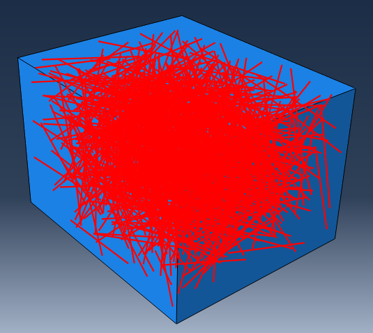

# Abaqus Random Fiber Generator

A Python-based framework for generating randomly oriented line fibers inside a three-dimensional box and automatically creating the corresponding Abaqus model.

This project combines random geometry generation with Abaqus scripting to generate reproducible finite element geometries containing randomly distributed one-dimensional fibers.

The code is designed for applications such as:

* Stochastic geometry generation
* Representative Volume Element (RVE) modeling
* Composite material simulations
* Random fiber distribution studies
* Abaqus automation workflows

## Example Generated Model

An example of the generated Abaqus geometry is shown below:



# Features

* Automatic generation of randomly positioned fibers in 3D
* Random fiber orientation using ZXZ Euler angles
* Base fiber orientation aligned with the global Z-axis
* Alpha Euler angle fixed to zero
* Uniform sampling of 3D fiber directions
* Automatic Abaqus wire geometry creation
* Support for large numbers of fibers
* Reproducible results using user-defined random seeds
* Modular Python architecture

# Repository Structure

```
abaqus-random-fiber-generator/

│
├── main.py
│   └── Main execution script
│
├── parameters.py
│   └── User-defined model parameters
│
├── generate_fibers.py
│   └── Random fiber generation algorithm
│
├── generate_model.py
│   └── Abaqus model construction
│
├── fibers_coordinates.py
│   └── 3D fiber endpoint calculation
│
├── rotation_matrix_zxz.py
│   └── ZXZ Euler rotation matrix calculation
│
├── README.md
│   └── Project documentation
│
├── LICENSE
│   └── MIT License
│
└── images/
    └── generated_model.png
        └── Example Abaqus fiber model screenshot
```

# Requirements

* Abaqus/CAE with Python scripting support
* Abaqus Python environment
* NumPy available in the Abaqus Python environment

The script is intended to be executed using Abaqus/CAE.

# Running the Script

The script can be executed using either the Abaqus command line interface or the Abaqus/CAE graphical user interface.

## Method 1: Run Using Abaqus Command Line

Place all Python files in the same folder.

Open the Abaqus Command Prompt, navigate to the project folder, and run:

```bash
abaqus cae noGUI=main.py
```

Abaqus will execute the script without opening the graphical interface.

## Method 2: Run Using Abaqus/CAE GUI

The script can also be executed directly from Abaqus/CAE.

Steps:

1. Place all Python files in the same folder.

2. Open **Abaqus/CAE**.

3. From the menu bar select:

```
File → Run Script...
```

4. Browse to the project folder.

5. Select:

```
main.py
```

6. Click **OK**.

Abaqus will execute the script and generate the model automatically.

# Generated Model

After successful execution, Abaqus creates a model named:

```
GeneratedModel
```

The generated model contains:

* A three-dimensional rectangular box.
* Randomly oriented line fibers.
* A single fiber part containing all generated wire geometries.

The generated model can then be:

* inspected,
* modified,
* meshed,
* assigned materials,
* assigned loads and boundary conditions,
* analyzed using the standard Abaqus workflow.

# Configuration

All user-defined parameters are located in:

```
parameters.py
```

Example:

```python
config = {
    "BOX_DIMS": (60.0, 40.0, 50.0),
    "FIBER_LENGTH": 25.0,
    "NUM_FIBERS": 1000,
    "MAX_ATTEMPTS": 100000,
    "RANDOM_SEED": 42,
}
```

## Parameters Description

| Parameter      | Description                                 |
| -------------- | ------------------------------------------- |
| `BOX_DIMS`     | Dimensions of the containing 3D box (X,Y,Z) |
| `FIBER_LENGTH` | Length of each fiber                        |
| `NUM_FIBERS`   | Number of fibers to generate                |
| `MAX_ATTEMPTS` | Maximum random placement attempts           |
| `RANDOM_SEED`  | Seed for reproducible geometry generation   |

# Algorithm Description

The geometry generation process consists of three main steps.

## 1. Random Orientation Generation

Each fiber is initially defined along the local Z-axis.

The fiber orientation is generated using ZXZ Euler angles:

* Alpha rotation around global Z-axis
* Beta rotation around global X-axis
* Gamma rotation around global Z-axis

For line fibers:

```
alpha = 0
```

because rotation around the fiber axis does not change the geometry.

The rotation matrix is calculated in:

```
rotation_matrix_zxz.py
```

## 2. Fiber Coordinate Transformation

Each fiber is initially defined in its local coordinate system:

```
(0,0,-L/2)
(0,0,+L/2)
```

The local coordinates are transformed into global coordinates using:

```
fibers_coordinates.py
```

The output is the start and end point of each fiber.

## 3. Abaqus Model Generation

After the fiber coordinates are generated, Abaqus creates a wire geometry containing all fibers.

Implemented in:

```
generate_model.py
```

# Workflow

```
Modify parameters.py
        |
        ↓
Run main.py in Abaqus
        |
        ↓
Generate random fiber positions and orientations
        |
        ↓
Transform local Z-axis fibers into global coordinates
        |
        ↓
Create Abaqus wire geometry
        |
        ↓
Continue with finite element modelling
```

# Reproducibility

The generated geometry can be reproduced by keeping the same:

* Random seed
* Box dimensions
* Fiber length
* Number of fibers

# Future Improvements

Possible future extensions:

* Automatic material assignment
* Automatic mesh generation
* Boundary condition generation
* Abaqus job submission automation
* Periodic boundary conditions
* Fiber volume fraction control
* Curved fiber generation
* Visualization utilities

# Author

**Ayad Al-Rumaithi**

# Citation

If you use this software in academic work, please cite it as:

```
Al-Rumaithi, A. (2026).
Abaqus Random Fiber Generator.
GitHub repository.
```

# License

This project is licensed under the MIT License.

See the `LICENSE` file for details.

# Acknowledgements

This project uses:

* Abaqus Python scripting environment
* NumPy numerical computing library
* ZXZ Euler angle rotation mathematics
